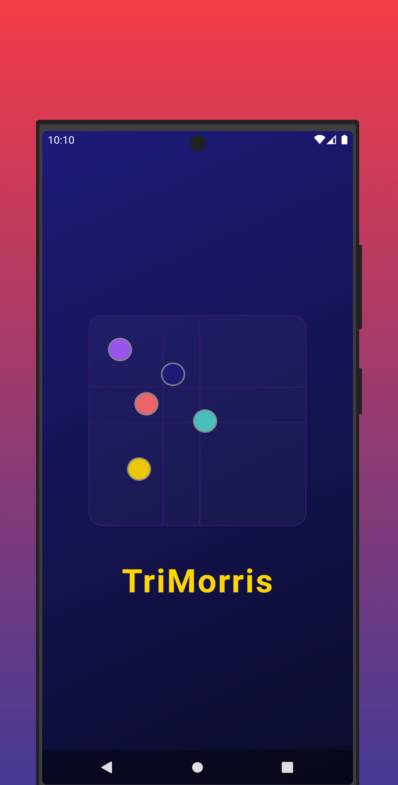
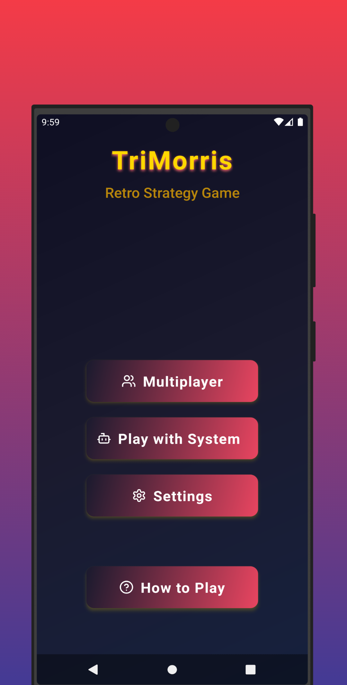
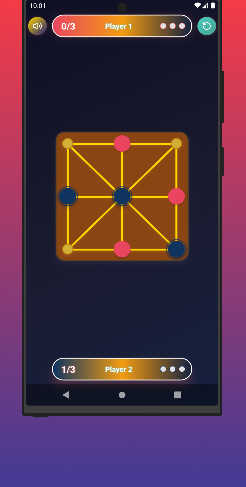
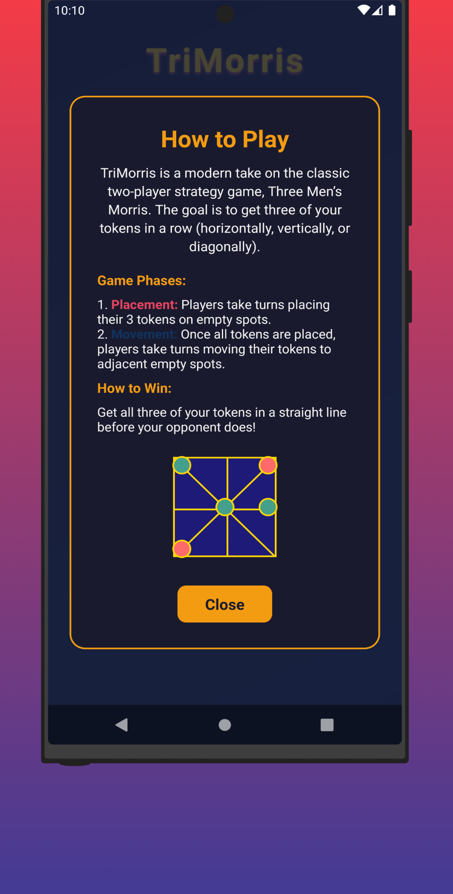
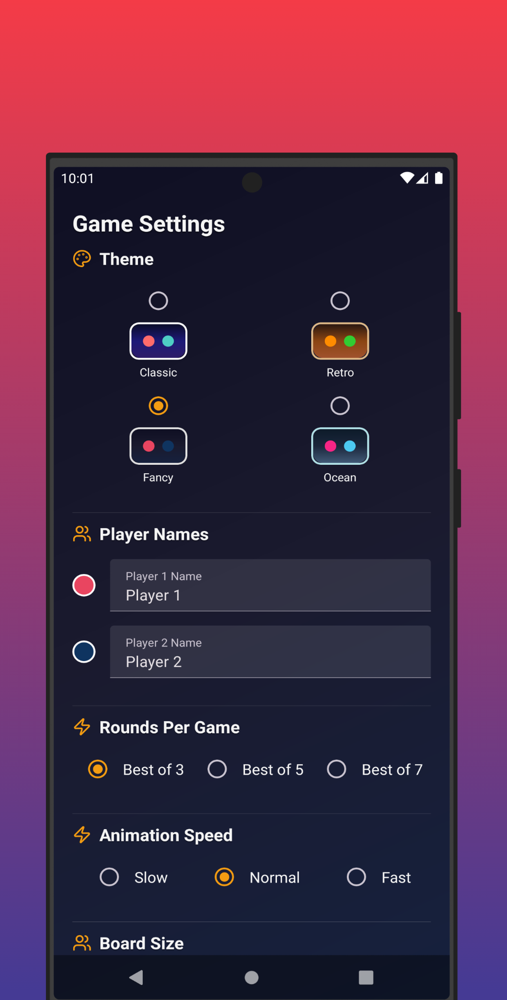

<div align="center">

# 🎮 TriMorris
### *The Ultimate Strategy Game Experience*

[](https://play.google.com/store/apps/details?id=com.ei.trimorris) [](https://play.google.com/store/apps/details?id=com.ei.trimorris) [](https://reactnative.dev) [](LICENSE)

<p align="center">
  <em>Master the ancient art of Three Men's Morris in this beautifully crafted modern adaptation!</em><br>
  <em>Challenge your mind with strategic gameplay that's easy to learn but impossible to master.</em>
</p>

</div>

---

## 📱 App Screenshots

<div align="center">
  <table>
    <tr>
      <td align="center">
        
        <br><em>Splash Screen</em>
      </td>
      <td align="center">
        
        <br><em>Home Screen</em>
      </td>
      <td align="center">
        
        <br><em>Game Screen</em>
      </td>
    </tr>
    <tr>
      <td align="center">
        
        <br><em>Tutorial</em>
      </td>
      <td align="center">
        
        <br><em>Settings</em>
      </td>
      <td align="center">
        <div style="width: 180px; height: 320px; display: flex; align-items: center; justify-content: center; background: linear-gradient(135deg, #667eea 0%, #764ba2 100%); border-radius: 15px; color: white; font-size: 48px;">
          🎮
        </div>
        <br><em>More Features!</em>
      </td>
    </tr>
  </table>
</div>

---

<div align="center">

## 🚀 Download Now

[](https://play.google.com/store/apps/details?id=com.ei.trimorris)

**[🎮 Get TriMorris on Google Play Store →](https://play.google.com/store/apps/details?id=com.ei.trimorris)**

</div>

---

## ✨ Game Features

<div align="center">
  <table>
    <tr>
      <td align="center" width="50%">
        <h3>🎮 Game Modes</h3>
        <p><strong>Multiplayer</strong> - Challenge friends locally</p>
        <p><strong>AI Opponent</strong> - Battle our smart AI system</p>
      </td>
      <td align="center" width="50%">
        <h3>🎨 Visual Design</h3>
        <p><strong>Retro Graphics</strong> - Beautiful themed designs</p>
        <p><strong>Smooth Animations</strong> - Fluid gameplay experience</p>
      </td>
    </tr>
    <tr>
      <td align="center">
        <h3>🔊 Audio Experience</h3>
        <p><strong>Sound Effects</strong> - Immersive game sounds</p>
        <p><strong>Multiple Themes</strong> - Various color schemes</p>
      </td>
      <td align="center">
        <h3>📚 Learning</h3>
        <p><strong>Interactive Tutorial</strong> - Animated demonstrations</p>
        <p><strong>Easy to Learn</strong> - Quick to understand rules</p>
      </td>
    </tr>
  </table>
</div>

---

## 🎯 How to Play

<div align="center">

**🏁 Goal:** *Align three tokens in a row (horizontal, vertical, or diagonal)*

**📍 Phase 1:** Place your 3 tokens strategically on empty spots  
**🔄 Phase 2:** Move tokens to adjacent positions to create winning combinations  
**🏆 Victory:** First to align three tokens wins!

</div>

---

## 🌟 Why Choose TriMorris?

<div align="center">
  <table>
    <tr>
      <td align="center">
        <h3>👨‍👩‍👧‍👦</h3>
        <strong>Family Friendly</strong><br>
        <em>Perfect for all ages</em>
      </td>
      <td align="center">
        <h3>⚡</h3>
        <strong>Quick Games</strong><br>
        <em>5-minute matches</em>
      </td>
      <td align="center">
        <h3>📱</h3>
        <strong>Offline Play</strong><br>
        <em>No internet needed</em>
      </td>
      <td align="center">
        <h3>🚫</h3>
        <strong>Ad-Free</strong><br>
        <em>Pure gaming fun</em>
      </td>
    </tr>
  </table>
</div>

---

## 🏆 Perfect For

<div align="center">

**Strategy Enthusiasts** • **Puzzle Lovers** • **Families** • **Classic Game Fans**

*Anyone who enjoys timeless board games with a modern twist!*

</div>

## 🛠️ Built With Modern Technologies

<div align="center">
  <table>
    <tr>
      <td align="center">
        
      </td>
      <td align="center">
        
      </td>
      <td align="center">
        
      </td>
    </tr>
    <tr>
      <td align="center">
        
      </td>
      <td align="center">
        
      </td>
      <td align="center">
        
      </td>
    </tr>
  </table>
</div>

<details>
<summary><strong>📋 Complete Tech Stack</strong></summary>

- 🚀 **React Native 0.82.1** - Cross-platform mobile development
- 📝 **TypeScript** - Type-safe development with better IDE support  
- 🗂️ **Redux Toolkit** - Predictable state management
- 🧭 **React Navigation** - Smooth navigation system
- 🎨 **React Native Paper** - Material Design components
- 🌈 **Linear Gradient** - Beautiful gradient backgrounds
- 🎯 **Lucide Icons** - Modern, consistent icon library
- 🔊 **React Native Sound** - Audio management
- 📱 **Safe Area Context** - Handle device-specific layouts

</details>

## 🚀 Development Setup

> **Note**: Make sure you have completed the [React Native Environment Setup](https://reactnative.dev/docs/set-up-your-environment) guide before proceeding.

### Prerequisites

- Node.js (>=20)
- React Native CLI
- Android Studio (for Android development)
- Xcode (for iOS development)

### Installation

1. **Clone the repository**
```bash
git clone https://github.com/shuraif/TriMorris.git
cd TriMorris
```

2. **Install dependencies**
```bash
npm install
# or
yarn install
```

3. **Install iOS dependencies (iOS only)**
```bash
cd ios
bundle install
bundle exec pod install
cd ..
```

### Running the App

1. **Start Metro bundler**
```bash
npm start
# or
yarn start
```

2. **Run on Android**
```bash
npm run android
# or
yarn android
```

3. **Run on iOS**
```bash
npm run ios
# or
yarn ios
```

## 📦 Build for Production

### Android

```bash
cd android
./gradlew bundleRelease
```

### iOS

```bash
npm run ios --configuration=Release
```

## 🤝 Contributing

1. Fork the repository
2. Create your feature branch (`git checkout -b feature/AmazingFeature`)
3. Commit your changes (`git commit -m 'Add some AmazingFeature'`)
4. Push to the branch (`git push origin feature/AmazingFeature`)
5. Open a Pull Request

## 📄 License

This project is licensed under the MIT License - see the [LICENSE](LICENSE) file for details.

---

<div align="center">

## 🎊 Ready to Play?

[](https://play.google.com/store/apps/details?id=com.ei.trimorris)

<p><em>🌟 Rediscover this timeless strategy masterpiece on your mobile device! 🌟</em></p>

---

### 📊 Project Stats


---

<table>
  <tr>
    <td align="center" width="33%">
      <h3>⭐ Rate Us</h3>
      <p>Love TriMorris?<br>Leave a review!</p>
    </td>
    <td align="center" width="33%">
      <h3>🐛 Found a Bug?</h3>
      <p>Open an issue<br>we'll fix it fast!</p>
    </td>
    <td align="center" width="33%">
      <h3>💡 Feature Ideas?</h3>
      <p>We'd love to hear<br>your suggestions!</p>
    </td>
  </tr>
</table>

---

<p>
  Made with ❤️ by <a href="https://github.com/shuraif">@shuraif</a><br>
  <em>© 2025 TriMorris - Strategic Gaming at its Finest</em>
</p>

<p>
  <a href="https://play.google.com/store/apps/details?id=com.ei.trimorris">📱 Play Store</a> •
  <a href="./HOW_TO_PLAY.md">📚 How to Play</a> •
  <a href="./LICENSE">📄 License</a> •
  <a href="https://github.com/shuraif/TriMorris/issues">🐛 Issues</a>
</p>

</div>